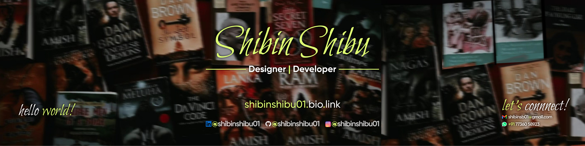

<h1 align="center">Hello World! </h1>

  

   
  <a href="https://shibinshibu01.bio.link/">Know More</a>
   

<h2>About Me</h2>

  👋 Hey there! I’m Shibin, a Computer Science graduate from MBCET with a passion for blending design and programming.

🎨 As a Graphic Designer and UI/UX Enthusiast, I love creating intuitive designs that not only look great but also deliver real value. Whether it’s leading creative teams or designing posters for large-scale events, I’ve consistently brought ideas to life through impactful visuals.

💻 On the tech side, I’ve worked on projects like PowerVortex — a smart home automation system where I contributed to the design, IoT, and machine learning components. I’ve also gained hands-on experience through internships at Vittore Corsetti Global and Out of the Box, refining my skills in marketing creatives and UI/UX design.

🚀 I’ve held leadership roles, including Creative Lead - South Region, Kerala for IEDC NEST, Kerala Startup Mission, and led operations at Catalyst Mar Baselios IEDC and IEEE SB MBCET. These roles sharpened my collaboration, creativity, and problem-solving skills while managing campaigns for major events.

🌟 Highlights:

- Awarded B.Tech Best Final Year Project from the Department of CSE, MBCET.

- Best Performer in Innovators' Premier League 2021 (South Region & Trivandrum) by KSUM.

- IEEEXtreme Rankings: Ranked 44 (16.0) and 112 (15.0) at the country level.

- IEEE Best Member: Recognized in 2022 and 2023.

- Skilled in Figma, C, Java, OOP concepts, HTML, CSS, and more

💬 Let’s connect! Whether you want to discuss design, tech, or potential collaborations, I’m always open to exciting opportunities.

<h2>Tech Stacks</h2>

     
     
     
     
     
     
     
     
     
     
     
     
     
    

  
   

  
  

  <h2>Let's Connect! 🤝</h2>
  

    
    
    
    
     
     
    
    
  

